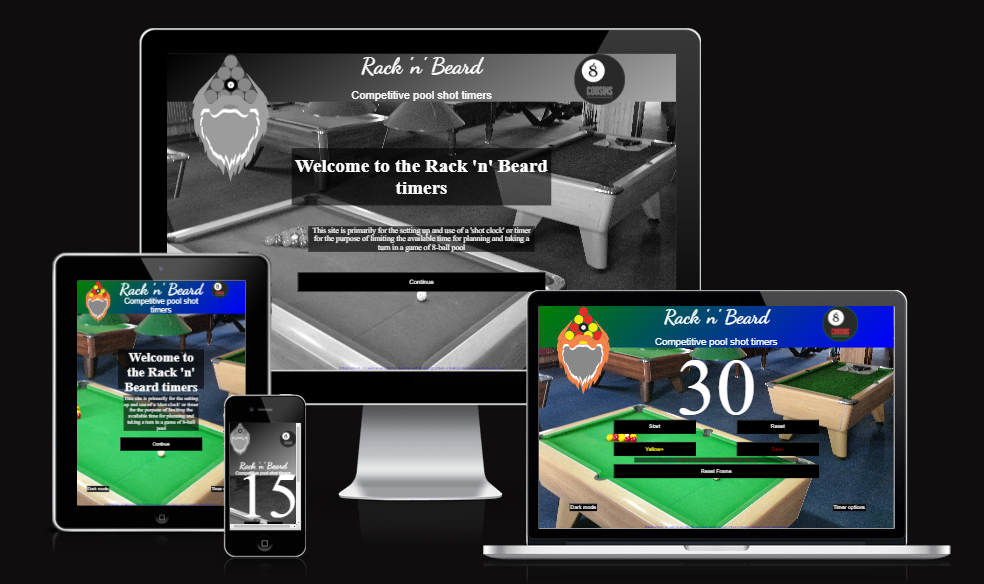

 
# Rack 'n' Beard Shot timer

Rack 'n' Beard shot timers is an online website that provides a selection of countdown timers for users to choose between, depending upon their requirements for the game or tournament that they are participating in.

These timers are developed with the express intention of being used within the game of 8-ball pool and has been designed to reflect this sport in the images and terminology used. Within this sport there are certain actions that can be invoked by the player/user, such as calling for an extension to their time to allow for further planning for their turn - however restrictions also apply to how and when these can be used.

