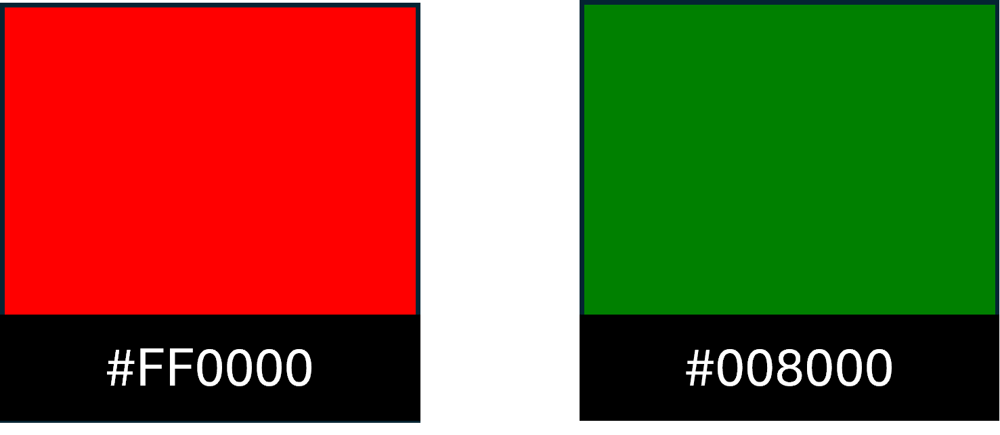

 
# Rack 'n' Beard Shot timer

Rack 'n' Beard shot timers is an online website that provides a selection of countdown timers for users to choose between, depending upon their requirements for the game or tournament that they are participating in.

These timers are developed with the express intention of being used within the game of 8-ball pool and has been designed to reflect this sport in the images and terminology used. Within this sport there are certain actions that can be invoked by the player/user, such as calling for an extension to their time to allow for further planning for their turn - however restrictions also apply to how and when these can be used.

[View the Rack 'n' Beard shot timer site here](https://hobbesunleashed.github.io/timers/)

- - -
## Table of Contents

### [User Experience (UX)](#user-experience-ux-1)
* [User Stories](#user-stories)
### [Design](#design-1)
### [Features](#features)
* [Existing Features](#existing-features)
### [Features Left to Implement](#features-left-to-implement-1)
### [Technologies Used](#technologies-used-1)
### [Frameworks, Libraries & Programs Used](#frameworks-libraries--programs-used-1)
### [Testing](#testing-1)
* [Validation Results](#validation-results)
* [Manual Testing](#manual-testing)
* [Lighthouse Report](#lighthouse-report)
### [Deployment and local development](#deployment-and-local-development-1)
* [GitHub Pages](#github-pages)
* [Forking the GitHub Repository](#forking-the-github-repository)
* [Local Clone](#local-clone)
### [Credits](#credits-1)
### [Acknowledgements](#acknowledgements-1)
---

## User Experience (UX)

This website was developed to allow 8-ball pool enthusiasts wishing to add a time restriction to their game. Other timers are available but limit the user to a single, pre-determined time for each visit to the table.

This site has the added benefit of allowing the user to choose between a selection of four individual timers ranging from 15 to 60 seconds, incrementing by 15 seconds.

There is also the added option of changing the presentation of the site from a black and white styling to an all colour option allowing for a little more personalisation for the user in how they view the site.

### User stories

 * First time visitor goals
    * To understand the purpose of the site is to offer the option of a shot-timer
    * To easily navigate through the options available and quickly set-up the required timer
    * To be able to change the output styling to match their requirement (colour or not)
    * To find that there is a beep and buzzer to identify when time is running out
 * Returning/frequent visitor goals
    * To know that the timer works, how to set-up and run throughout their game(s)
    * To have confidence in the timer and the options presented to ensure a smooth game and accurate recording of the time
    * To know that the options to add an extension of 15 seconds will work in the way that is used professionally within the sport, making for a better practice and preparation for progressing to the next stage of their game

---

## Design

* Colour Scheme
    * Primary colors scheme on the website:   
    

    * Secondary colors scheme on the website:
    

    * Extension button colors:
    

    * Additonal information colors:
    

* Typography
    * _Monserrat_ font is main font used throughout the site with _sans-serif_ as its fallback font in case _Monserrat_ isn't supported for some reason.
    * The Header is split into two sections:
        * Site 'Title' is styled using the Google font _Dancing Script_ with _cursive_ as its fallback, in case _Dancing Script_ doesn't import for some reason.
        * Site 'Slogan' is styled using the Google font _Satisfy_ with _cursive_ as its fallback, in case _Satisfy_ doesn't import for some reason.

* Wireframes
    * Pen and paper in a notebook: simple and effective.

---

## Features

 * Site is for the sole purpose of selecting and running a shot-timer of a specific length
 * Additional restrictions do apply within the site, namely around the use of extensions

 _This website is set to display in black and white as a default, images below are in colour to show the alternative_

### Existing features

 * Site title
    * The site title is text based and consists of the _brand_ name and a _slogan_
    * The title is static throughout the site, with slight movement dependent upon the user screen size
    

 * Logos
    * There are two logos on the site page, one for _Rack 'n' Beard productions_, the other for _Cousins Snooker and Pool hall_ who were gracious and allowed use of images of their club
        * The _Rack 'n' Beard_ logo comprises of an image of a set of English 8-ball pool balls set and ready for a break, with a beard attached to make the logo resemble a face
        * The -Cousins_ logo resembles an 8-ball from the same game with their name emblazoned across it also
        * Logos remain in the top-left and top-right of the screen throughout, although align slightly differently depending upon the user screen size
        

 * Navigation
    * This is a single page site, utilising css and javascript to show and hide elements as required and replace with the users selection
    * Site is relatively linear and can be progressed through using the _continue_ buttons, or making selections
    * Users can navigate back to make changes to their selections, but the home/welcome page is only available when entering the site or refreshing the page in browser

 * Welcome/Landing screen
    * Provides information about the purpose of the website to the user
    * Allows the user to continue beyond this screen
    
    

 * Timer selection screen
    * Provides four options to choose from to populate a timer for the users match
    * Once an option is chosen the screen automatically proceeds to the timer itself
    

 * Coundown screen
    * Provides the selected timer on screen along with options to be used throughout the game
    * _Start/Pause/Resume_ button changes its text depending on the state of the clock
    * _Reset_ button to reset the timer, whilst maintaining tracking of this individual game/frame
    * _Yellow_ and _Red_ extension buttons - these work in the same way as eachother, but can only be used once per player per frame of pool
    * Warning to users that the extension is a standard addition of 15 seconds
    * _Reset Frame_ button to reset all variables to their starting points of this screen, allowing for more than one frame to be played within a match
    

 * Footer section
    * Within the footer section there are three elements
    * A button to control whether the site remains in the default black and white or changes to colour
    * A button to return to or progress to the _Timer selection screen_
    * Copyright information in x-small font at the bottom center of the page
    

---

## Future features
 * An option to add a match-timer, allowing for a game to last only a specific amount of time from start to finish
 * Match-timer will have the over-arching control of the shot-timer and will pause/reset all if needed
 * Input for users to add names to the Match-timer
 * A frame counter, to track how many frames/games each inputted user has won so far
 * A Match limit for frames, should a game reach its maximum frames for a win before match-timer runs out then the game will stop

 ---
 
 ## Technologies Used

 * [HTML5](https://en.wikipedia.org/wiki/HTML5)
 * [CSS3](https://en.wikipedia.org/wiki/CSS)
 * [Javascript](https://en.wikipedia.org/wiki/JavaScript)

 ---

 ## Frameworks, Libraries & Programs Used

 * [Gitpod](https://www.gitpod.io/)
    * To write the code.
 * [Git](https://git-scm.com/)
    * for vesion control.
 * [Github](https://github.com/)
    * Deployment of the website and storing the files online.
 * [Google Fonts](https://fonts.google.com/)
    * Import main font the website.
* [Am I Responsive](https://ui.dev/amiresponsive)
    * Mockup picture for the README file.

---

---

## Deployment and local development

### GitHub Pages

GitHub Pages used to deploy live version of the website.
1. Log in to GitHub and locate [GitHub Repository Rack 'n' Beard shot timers](https://github.com/HobbesUnleashed/timers)
2. At the top of the Repository(not the main navigation) locate "Settings" button on the menu.
3. Scroll down the Settings page until you locate "GitHub Pages".
4. Under "Source", click the dropdown menu "None" and select "Main" and click "Save".
5. The page will automatically refresh.
6. Scroll back to locate the now-published site [link](https://hobbesunleashed.github.io/timers/) in the "GitHub Pages" section.

### Forking the GitHub Repository

By forking the repository, we make a copy of the original repository on our GitHub account to view and change without affecting the original repository by using these steps:

1. Log in to GitHub and locate [GitHub Repository Rack 'n' Beard shot timers](https://github.com/HobbesUnleashed/timers)
2. At the top of the Repository(under the main navigation) locate "Fork" button.
3. Now you should have a copy of the original repository in your GitHub account.

### Local Clone

1. Log in to GitHub and locate [GitHub Repository Rack 'n' Beard shot timers](https://github.com/HobbesUnleashed/timers)
2. Under the repository name click "Clone or download"
3. Click on the code button, select clone with HTTPS, SSH or GitHub CLI and copy the link shown.
4. Open Git Bash
5. Change the current working directory to the location where you want the cloned directory to be made.
6. Type `git clone` and then paste The URL copied in the step 3.
7. Press Enter and your local clone will be created.

---

## Credits

### Code

 * The README template was helpfully provided by [Code Institute (template)](https://github.com/Code-Institute-Solutions/readme-love-maths/blob/master/README.md)
 * Mozilla Developer Network (MDN) for understanding JavaScript built-in methods.
 * W3School for helpful insights into JavaScript functions and methods
 * W3Schools: Countdown timers: [link](https://www.w3schools.com/howto/howto_js_countdown.asp), helped me to understand timers within JavaScript
 * W3Schools: [link](https://www.w3schools.com/Jsref/met_win_setinterval.asp), helped me understand time intervals and assign accurately.
 
 ### Content

  * All content was written by the developer.
  * [Font Awesome](https://fontawesome.com/) was used to obtain the free icon for the header.
  * Same icon was used to create a favicon the the website.

### Media

 * [Font Awesome](https://fontawesome.com/)
 * [Color Mind](http://colormind.io/)
 * [Am I responsive?](https://ui.dev/amiresponsive)

---

## Acknowledgements

 * My mentor Mitko Bachvarov provided helpful feedback.
 * Slack community for encouragement.